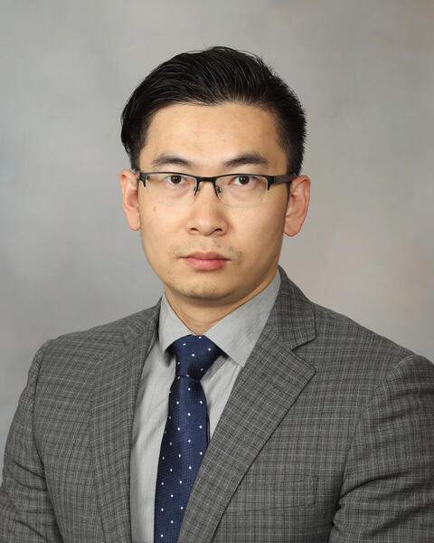

# Workshop of Large Language Model and Prompting in the Biomedical and Healthcare (ACM BCB 2023)
## About this workshop
The utilization of large language models (LLMs) and prompting has witnessed a surge in popularity over the past few years, particularly in the field of natural language processing (NLP) and chatbots. A prime example of this is ChatGPT, a sophisticated conversational agent powered by LLMs, which has become increasingly prevalent in a range of industries, including healthcare. The healthcare industry has experienced a significant shift in recent years towards the digitization of patient records, resulting in vast amounts of medical data that can be challenging to manage and analyze. NLP has emerged as a critical tool in this regard, enabling the extraction of relevant information from medical records and other related documents. With the aid of LLMs and prompting, NLP has the potential to revolutionize healthcare by facilitating faster and more accurate analysis of medical data, leading to improved patient outcomes and more effective treatments. LLMs and prompting can be particularly useful in healthcare applications such as clinical decision support systems, where they can assist healthcare providers in making informed decisions based on the patient's medical history, symptoms, and other relevant data. Despite the numerous benefits of LLMs and prompting in healthcare, their use raises some concerns regarding data privacy and ethical considerations. The vast amounts of data required to train these models can potentially result in the unauthorized access and misuse of personal and sensitive information. Moreover, there is the risk of bias in these models, as the data used to train them may not be representative of the diverse population they aim to serve. By addressing these concerns and implementing appropriate safeguards, the healthcare industry can fully leverage the potential of LLMs and prompting to revolutionize patient care and drive improvements in healthcare outcomes.

The proposed workshop will cover the technologies and the use cases of LLMs and prompting in the field of biomedical and healthcare. The workshop will also discuss the challenges and concerns associated with implementing LLMs and prompting in biomedical and healthcare. Attendees will have the opportunity to learn about the latest developments in this field and their potential impact on improving patient outcomes.

## Schedule
-	Introduction (5 minutes)
-	Presentations of “Large Lanague Models: Past, Current, and Future” by Dr. Hongfang Liu (40 minutes)
-	Presentations of “Opportunities and Challenges of Large Language Models in Healthcare” by Dr. Yonghui Wu (40 minutes) 
-	Presentations of “ChatGPT in Action: An Experimental Investigation of Its Effectiveness in NLP Tasks” by Dr. Xia Hu (40minutes)
-	Coffee break (10 minutes)
-	Presentations of “Prompting ChatGPT in extracting domain knowledge to facilitate the computational drug repurposing” by Dr. Nansu Zong (40 minutes)
-	Presentations of “LLM and drug synergy prediction” by Dr. Xiaoqian Jiang (40 minutes)
-	Panel discussion  (40 minutes)

## 	Presentations

-  

Large Language Models: Past, Current, and Future (By Dr. Hongfang Liu): The realm of large language models (LLMs) has undergone tremendous growth and progress, bringing about a transformative effect on natural language processing and AI as a whole. This presentation will delve deeply into the past, present, and future of large language models. Dr. Liu will investigate the origins of language models, beginning with the earliest rule-based models and moving on to more sophisticated models. Dr. Liu will analyze the advancements that have contributed to their widespread adoption and the influence they have had on the field of AI and beyond. Finally, the talk will cover the potential for further progress and the ethical implications associated with constructing such potent models. This lecture offers an inclusive overview of large language models, their history, and future prospects.

-	
  
Opportunities and Challenges of Large Language Models in Healthcare (By Dr. Yonghui Wu): The conversational artificial intelligence (AI) from large language models (LLMs) such as ChatGPT has surprised the world with good abilities not only in communicating with humans but also in generating good quality textual content such as presentations, emails, articles, and even computer source codes, approaching human-like language processing.  People are curious about its potential utility for healthcare.  LLMs bring substantial opportunities and challenges not only to clinical natural language processing but also to artificial intelligence (AI) in electronic health record (EHR) systems and healthcare.  Based on the experience in developing and applying clinical LLMs, this keynote talk will overview the recent progress of LLMs, identify opportunities in using LLMs for intelligent electronic health record systems and better healthcare, and examine potential risks, bias, and disparities of this disruptive AI technology.

-	

ChatGPT in Action: An Experimental Investigation of Its Effectiveness in NLP Tasks (By Dr. Xia Hu): The recent progress in large language models has resulted in highly effective models like OpenAI's ChatGPT that have demonstrated exceptional performance in various tasks, including question-answering, essay writing, and code generation. This presentation will cover the evolution of LLMs from BERT to ChatGPT and showcase their use cases. Although LLMs are useful for many NLP tasks, one significant concern is the inadvertent disclosure of sensitive information, especially in the healthcare industry, where patient privacy is crucial. To address this concern, we developed a novel framework that generates high-quality synthetic data using ChatGPT and fine-tunes a local offline model for downstream tasks. The use of synthetic data improved the performance of downstream tasks, reduced the time and resources required for data collection and labeling, and addressed privacy concerns. Finally, we will discuss the regulation of LLMs, which has raised concerns about cheating in education. We will introduce our recent survey on LLM-generated text detection and discuss the opportunities and challenges it presents.

-	
Prompting ChatGPT in extracting domain knowledge to facilitate the computational drug repurposing (By Dr. Nansu Zong): Dr. Zong proposes the utilization of ChatGPT to extract domain knowledge for predicting drug responses. Specifically, the biomedical associations between drugs, targets, diseases, and pathways will be extracted to enhance the understanding of cancer cell lines and drugs concerning drug sensitivity prediction. The effectiveness of this approach will be compared with other traditional methods based on knowledge graphs. Moreover, Dr. Zong's team will evaluate the models' generalizability by testing them on independent datasets. Overall, this research aims to demonstrate the potential of ChatGPT in extracting domain knowledge for drug response prediction and improving the accuracy of drug sensitivity prediction.

-	
LLM and drug synergy prediction (By Dr. Xiaoqian Jiang): Large pre-trained language models (LLMs) have been shown to have significant potential in few-shot learning across various fields, even with minimal training data. However, their ability to generalize to unseen tasks in more complex fields, such as biology, has yet to be fully evaluated. LLMs can offer a promising alternative approach for biological inference, particularly in cases where structured data and sample size are limited, by extracting prior knowledge from text corpora. Our proposed few-shot learning approach uses LLMs to predict the synergy of drug pairs in rare tissues that lack structured data and features. Our experiments, which involved seven rare tissues from different cancer types, demonstrated that the LLM-based prediction model achieved significant accuracy with very few or zero samples. Our proposed model, the CancerGPT (with 124M parameters), was even comparable to the larger fine-tuned GPT-3 model (with 175B parameters).

-	The Panel discussion: A 40-minute panel will mainly bring more insight into the LLM (e.g., ChatGPT) and prompting in the context of biomedical and healthcare. Specifically, the challenges in biomedical and healthcare applications and the existing solutions in recent work will be discussed. We will also share the resources and tools that can be used to contribute to solving the open problems in LLM  and prompting.

## 	Presenter
-	Dr. Nansu Zong is an Assistant Professor from the Mayo Clinic's Department of Artificial Intelligence and Informatics Research. The primary goal of his team is to develop AI-powered predictive models by utilizing healthcare data and biomedical knowledge. They are at the forefront of developing new AI techniques for computational drug repurposing and predicting treatment outcomes through electronic health records. Dr. Zong is also the vice chair of the Biomedical Knowledge Representation and Semantics Workgroup at AMIA.

-	Dr. Yonghui Wu is an Associate Professor in the Department of Health Outcomes and Biomedical Informatics at the University of Florida (UF) College of Medicine.  He also serves as the Director of Natural Language Processing (NLP) at UF Clinical and Translational Science Institute (CTSI) and OneFlorida Clinical Research Consortium. His research has contributed substantially to various applications to apply NLP and machine learning to solve clinical and translational problems.  He recently developed GatorTron, the largest language model in the clinical domain using over 82 billion words of clinical text.  Dr. Wu will present his work in developing GatorTron - a clinical LLM with 8.9 billion parameters, and GatorTronGPT - a GPT-3 LLM with 20 billion parameters.

-	Dr. Xia Hu is an Associate Professor at Rice University in the Department of Computer Science and director of the Center for Transforming Data to Knowledge (D2K Lab). Dr. Hu has published over 100 papers in several major academic venues, including NeurIPS, ICLR, KDD, WWW, IJCAI, AAAI, etc. An open-source package developed by his group, namely AutoKeras, has become the most used automated deep learning system on GitHub (with over 8,000 stars and 1,000 forks). Also, his work on deep collaborative filtering, anomaly detection, and knowledge graphs have been included in the TensorFlow package, Apple production system, and Bing production system, respectively. His papers have received several Best Paper (Candidate) awards from venues such as ICML, WWW, WSDM, ICDM, AMIA, and INFORMS. He is the recipient of the NSF CAREER Award and ACM SIGKDD Rising Star Award. His work has been cited more than 18,000 times with an h-index of 51. He is the conference General Co-Chair for WSDM 2020 and ICHI 2023. He is also the founder of AI POW LLC.

-	Dr. Hongfang Liu holds the position of Professor of Biomedical Informatics at the Department of Artificial Intelligence & Informatics at the Mayo Clinic. She has been responsible for directing the Biomedical Informatics program at the Mayo Clinic Center for Clinical and Translational Science since 2015 and has led the Cancer Data Science and Informatics at the Mayo Clinic Comprehensive Cancer Center since 2022. In addition, Dr. Liu has been a highly regarded professor in the Artificial Intelligence in Health Care Masters degree program at the Mayo Clinic Graduate School of Biomedical Sciences since 2020. Dr. Liu was recognized for her numerous achievements, visionary and transformative thought leadership, and significant scholarly contributions with the "Donald A.B. Lindberg Award for Innovation in Informatics" by the American Medical Informatics Association (AMIA) in 2022. She is also a Fellow of the American College of Medical Informatics, Deputy Editor of Health Data Science (a Science Partner Journal), member of the Informatics Domain Task Force of the National Clinical and Translational Science Awards Consortium, and leader of the Natural Language Processing Working Group at AMIA.

-	Dr. Xiaoqian Jiang is the Associate Vice President of Medical AI and Christopher Sarofim Family Professor at the University of Texas Health Science Center at Houston (UTHealth). He is an expert in privacy-preserving data mining, federated learning, and knowledge/data co-teaching models. With more than 10 years of experience in bringing these two worlds together, Dr. Jiang has constantly worked on developing novel application-driven AI models with a deep understanding of healthcare data and knowledge. His work has received several best and distinguished paper awards from American Medical Informatics Association (AMIA) Joint Summits on Translational Science (2012, 2013, 2016) and AMIA annual conference in 2020. 
